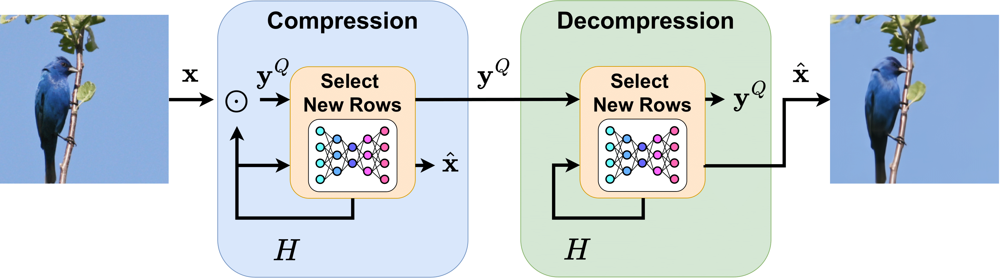

# PSC: Posterior Sampling-Based Compression
<a href="https://noamelata.github.io/">Noam Elata</a>, <a href="https://tomer.net.technion.ac.il/">Tomer Michaeli</a>, <a href="https://elad.cs.technion.ac.il/">Michael Elad</a><br><br>

  [`ArXiv`](https://arxiv.org/abs/2407.09896) <br>

## Abstract
Diffusion models have transformed the landscape of image generation and now show remarkable potential for image compression. Most of the recent diffusion-based compression methods require training and are tailored for a specific bit-rate. In this work, we propose Posterior Sampling-based Compression (PSC) - a zero-shot compression method that leverages a pre-trained diffusion model as its sole neural network component, thus enabling the use of diverse, publicly available models without additional training. Our approach is inspired by transform coding methods, which encode the image in some pre-chosen transform domain. However, PSC constructs a transform that is adaptive to the image. This is done by employing a zero-shot diffusion-based posterior sampler so as to progressively construct the rows of the transform matrix. Each new chunk of rows is chosen to reduce the uncertainty about the image given the quantized measurements collected thus far. Importantly, the same adaptive scheme can be replicated at the decoder, thus avoiding the need to encode the transform itself. We demonstrate that even with basic quantization and entropy coding, PSC's performance is comparable to established training-based methods in terms of rate, distortion, and perceptual quality. This is while providing greater flexibility, allowing to choose at inference time any desired rate or distortion. 

## Requirements
Please install a recent version of PyTorch (>=2.5), torchvision, diffusers, transformers, and tqdm.

## Usage
**This is a preliminary implementation version.**
**It only enables sampling with [Stable Diffusion 2.1 base](https://huggingface.co/stabilityai/stable-diffusion-2-1-base) and does not utilize entropy encoding.** 

To evaluate PSC's performance on a directory of images, run:
```bash
python evaluate.py --data-dir <path to image dir> \
                   --outdir <where to save outputs> \
                   --num-samples <number of images to generate at each iteration> \
                   --rank <number of measurements to acquire at each iteration> \
                   --iters <number of iterations> \
                   --simulate
```

For example:
```bash
python evaluate.py --data-dir data/div2k --outdir results/ --iters 256 --simulate
```
To use image captions for image compression, add `--use-caption` to caption the image using [BLIP2](https://huggingface.co/Salesforce/blip2-opt-2.7b-coco). The captions are included in the compressed representation, increasing the bit-rate.

Remove `--simulate` to preform the compression and decompression separately. Increases runtime by a factor of 2.

## References
```BibTeX
@misc{elata2024posterior,
      title={PSC: Posterior Sampling-Based Compression}, 
      author={Noam Elata and Tomer Michaeli and Michael Elad},
      year={2024},
      eprint={2407.09896},
      archivePrefix={arXiv},
      primaryClass={cs.CV},
      url={https://arxiv.org/abs/2407.09896}, 
}
```